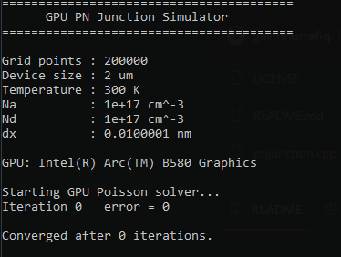

<p align="center">
  
</p>

# GPU PN Junction Simulator

A 1D semiconductor PN junction simulator written in **C++ and SYCL**, designed to execute numerical calculations on a GPU using the **Intel oneAPI DPC++/C++ Compiler (`icpx`)**.

The project solves a simplified semiconductor **Poisson equation** on a 1D spatial grid and calculates the resulting electric potential and electric field.

> **Status:** Educational / experimental numerical simulator
> **Language:** C++
> **GPU API:** SYCL
> **Compiler:** Intel oneAPI DPC++/C++ Compiler
> **Primary target:** Intel GPUs

---

## Features

* 1D abrupt PN junction
* Silicon material parameters
* Configurable temperature
* Configurable donor and acceptor doping
* 200,000 spatial grid points by default
* GPU-accelerated charge-density calculation
* GPU-accelerated Poisson iteration
* Electric-field calculation
* CSV output
* SYCL-based parallel execution
* Designed to run on Intel GPUs

The current implementation uses SYCL kernels such as `parallel_for()` to perform calculations over the spatial grid in parallel.

---

# 1. Requirements

## Hardware

A GPU capable of running the SYCL device runtime is recommended.

The primary target for this project is an **Intel GPU**, such as:

* Intel Arc B580
* Intel Arc A-series
* Other supported Intel GPU devices

A compatible and sufficiently recent Intel GPU driver is required when running SYCL workloads on Intel GPUs.

---

## Operating System

The current instructions are written for:

**Windows 10/11 64-bit**

The Intel oneAPI DPC++/C++ Compiler supports 64-bit Windows and Linux environments.

---

# 2. Required Software

## Intel oneAPI DPC++/C++ Compiler

This project requires the Intel oneAPI DPC++/C++ Compiler.

The compiler provides:

```text
icpx
SYCL
DPC++
Intel SYCL runtime
```

Official download:

https://www.intel.com/content/www/us/en/developer/tools/oneapi/dpc-compiler-download.html

You can install the standalone DPC++/C++ Compiler or the Intel oneAPI Toolkit.

---

# 3. Microsoft Visual Studio

On Windows, install Visual Studio with:

```text
Desktop development with C++
```

The C++ development components are required for the Windows compiler environment.

Visual Studio is not required as the editor for this project.

---

# 4. Intel GPU Driver

If the program is intended to execute on an Intel GPU, install the appropriate Intel graphics driver.

For example:

```text
Intel Arc B580
```

should be correctly detected by Windows.

---

# 5. Initializing the oneAPI Environment

The `icpx` command may not be available from a normal PowerShell or Command Prompt until the oneAPI environment has been initialized.

The default installation location is typically:

```text
C:\Program Files (x86)\Intel\oneAPI\
```

The environment script is:

```text
C:\Program Files (x86)\Intel\oneAPI\setvars.bat
```

---

# 6. Recommended Method: Intel oneAPI Command Prompt

The easiest method on Windows is to open:

```text
Intel oneAPI Command Prompt
```

from the Windows Start Menu.

Then verify the compiler:

```cmd
icpx --version
```

A successful installation should display information about the Intel oneAPI DPC++/C++ Compiler.

---

# 7. Manual Environment Initialization

If the Intel oneAPI Command Prompt is not available, initialize the environment manually.

Open Command Prompt and run:

```cmd
"C:\Program Files (x86)\Intel\oneAPI\setvars.bat"
```

Then verify:

```cmd
icpx --version
```

You can also check:

```cmd
set SETVARS_COMPLETED
```

Expected:

```text
SETVARS_COMPLETED=1
```

---

# 8. PowerShell

If you normally use PowerShell, launch a PowerShell environment from the initialized oneAPI environment:

```cmd
cmd.exe /K ""C:\Program Files (x86)\Intel\oneAPI\setvars.bat" && powershell"
```

Then:

```powershell
icpx --version
```

---

# 9. Verify SYCL

Create:

```text
test_sycl.cpp
```

with:

```cpp
#include <sycl/sycl.hpp>
#include <iostream>

int main()
{
    sycl::queue q{sycl::gpu_selector_v};

    std::cout
        << "GPU: "
        << q.get_device()
             .get_info<sycl::info::device::name>()
        << "\n";

    return 0;
}
```

Compile:

```powershell
icpx -fsycl test_sycl.cpp -o test_sycl.exe
```

Run:

```powershell
.\test_sycl.exe
```

The program should report the selected GPU.

---

# 10. Compile the PN Junction Simulator

Navigate to the project directory:

```powershell
cd C:\Users\Admin\Documents
```

Compile:

```powershell
icpx -fsycl pnjunction.cpp -o pnjunction.exe
```

The important option is:

```text
-fsycl
```

This enables SYCL compilation.

---

# 11. Run the Simulator

After successful compilation:

```powershell
.\pnjunction.exe
```

Example output:

```text
========================================
      GPU PN Junction Simulator
========================================

Grid points : 200000
Device size : 2 um
Temperature : 300 K
Na          : 1e+17 cm^-3
Nd          : 1e+17 cm^-3

GPU: Intel(R) Arc(TM) B580 Graphics

Starting GPU Poisson solver...
...
Simulation finished.
Results saved to pn_junction.csv
========================================
```

---

# 12. Output

The simulator generates:

```text
pn_junction.csv
```

The CSV contains:

```text
x_m
potential_V
electric_field_V_per_m
```

The data can be opened with:

* Microsoft Excel
* LibreOffice Calc
* Python
* MATLAB
* GNU Octave
* Origin
* Other numerical-analysis software

---

# 13. Physical Model

The simulator represents an abrupt 1D PN junction.

The charge density is modeled as:

```text
rho = q(p - n + Nd - Na)
```

where:

```text
q  = elementary charge
p  = hole concentration
n  = electron concentration
Nd = donor concentration
Na = acceptor concentration
```

The Poisson equation is:

```text
d²V/dx² = -rho/epsilon
```

The electric field is:

```text
E = -dV/dx
```

The current implementation uses simplified Boltzmann-like carrier expressions for `n` and `p`.

---

# 14. Default Parameters

```text
Temperature:
300 K

Silicon relative permittivity:
11.7

Intrinsic carrier concentration:
1.0 × 10^10 cm^-3

Acceptor concentration:
1.0 × 10^17 cm^-3

Donor concentration:
1.0 × 10^17 cm^-3

Simulation length:
2 µm

Grid points:
200,000
```

The doping profile is an abrupt junction:

```text
P-type | N-type
-------|-------
 Na    |  Nd
```

with the junction positioned approximately at the center of the simulation domain.

---

# 15. Why GPU?

The simulation divides the semiconductor into many spatial points.

The default configuration uses:

```text
N = 200,000
```

grid points.

Many calculations over these points can be performed independently, making them suitable for GPU parallelization.

SYCL expresses these calculations using kernels such as:

```cpp
queue.submit([&](sycl::handler& h)
{
    h.parallel_for(
        sycl::range<1>(N),
        [=](sycl::id<1> i)
        {
            // Calculation for one grid point
        }
    );
});
```

Conceptually:

```text
CPU
 │
 └── Submit work
        │
        ▼
      GPU
 ┌────┬────┬────┬────┬────┐
 │ x0 │ x1 │ x2 │ x3 │ ...│
 └────┴────┴────┴────┴────┘
        │
        ▼
 Parallel numerical calculation
```

This makes the project both a **semiconductor physics simulation** and an experiment in **GPU-accelerated computational physics**.

---

# 16. Project Structure

A minimal project:

```text
PNJunction-GPU/
│
├── asset/
│   └── 2f2827c8-aaf9-4e25-b9e3-3da69832d25a.png
│
├── pnjunction.cpp
├── README.md
└── pn_junction.csv
```

`pn_junction.csv` is generated after running the program and does not need to be committed to GitHub unless desired.

---

# 17. Troubleshooting

## `sycl/sycl.hpp: No such file or directory`

Example:

```text
fatal error: sycl/sycl.hpp: No such file or directory
```

Make sure you are using:

```text
icpx
```

rather than:

```text
g++
```

Compile with:

```powershell
icpx -fsycl pnjunction.cpp -o pnjunction.exe
```

Also make sure the oneAPI environment has been initialized.

---

## `icpx is not recognized`

Initialize oneAPI:

```cmd
"C:\Program Files (x86)\Intel\oneAPI\setvars.bat"
```

or open:

```text
Intel oneAPI Command Prompt
```

Then:

```cmd
icpx --version
```

---

## `get_host_access` compilation error

If using a newer SYCL implementation and the compiler reports an error around:

```cpp
get_host_access<access::mode::read>()
```

use a `sycl::host_accessor` instead:

```cpp
sycl::host_accessor Vnew_host(
    Vnew_buf,
    sycl::read_only
);
```

The same approach should be used for other host-side buffer reads.

---

## GPU is not detected

Check:

1. Intel GPU driver
2. GPU visibility in Windows
3. oneAPI installation
4. SYCL runtime
5. SYCL device selection

A simple test:

```cpp
sycl::queue q{sycl::gpu_selector_v};

std::cout
    << q.get_device()
       .get_info<sycl::info::device::name>();
```

---

# 18. Numerical and Physical Limitations

This project is intended primarily for:

* education
* experimentation
* computational physics
* GPU programming
* semiconductor physics study

The current implementation is **not a production TCAD simulator**.

Current limitations include:

* simplified carrier statistics
* simplified equilibrium assumptions
* simplified boundary conditions
* simplified doping model
* no advanced mobility model
* no detailed recombination model
* no generation model
* no Fermi-Dirac statistics
* no quantum effects
* no detailed temperature-dependent material model
* 1D geometry only
* simplified numerical solver
* no rigorous validation against commercial TCAD software

Numerical results should therefore not be interpreted as experimentally validated semiconductor-device predictions.

---

# 19. Theoretical Validation

For an equilibrium PN junction, the simulator can eventually be compared against the analytical built-in potential:

```text
Vbi = VT ln(Na Nd / ni²)
```

where:

```text
VT = kT/q
```

For the default parameters:

```text
Na = 1 × 10^17 cm^-3
Nd = 1 × 10^17 cm^-3
ni = 1 × 10^10 cm^-3
T  = 300 K
```

the analytical result can be used as a reference for validating the numerical solver.

Future validation should compare:

```text
Analytical solution
        vs
CPU numerical solution
        vs
GPU numerical solution
```

---

# 20. Future Development

## Semiconductor Physics

* Depletion approximation
* Built-in potential
* Debye length
* Depletion width
* Carrier concentration
* Fermi level
* Band diagrams
* Shockley diode equation
* Drift-diffusion
* Continuity equations
* Recombination
* Generation
* Temperature dependence

## Device Simulation

```text
PN Junction
     ↓
Diode
     ↓
MOS Capacitor
     ↓
MOSFET
     ↓
BJT
```

## GPU Computing

* Optimized SYCL kernels
* GPU/CPU benchmarking
* Conjugate Gradient solver
* Multigrid methods
* 2D simulation
* 3D simulation
* Memory optimization
* Mixed precision
* GPU profiling

## Visualization

Future versions can visualize:

```text
Potential V(x)
Electric field E(x)
Electron density n(x)
Hole density p(x)
Charge density rho(x)
```

---

# 21. Example Workflow

Complete Windows workflow:

```cmd
:: Open Intel oneAPI Command Prompt

:: Check compiler
icpx --version

:: Enter project directory
cd /d C:\Users\Admin\Documents

:: Compile
icpx -fsycl pnjunction.cpp -o pnjunction.exe

:: Run
pnjunction.exe
```

PowerShell:

```powershell
cd C:\Users\Admin\Documents

icpx -fsycl pnjunction.cpp -o pnjunction.exe

.\pnjunction.exe
```

---

# 22. License

Add the project's license here.

For example:

```text
MIT License
```

if the project is intended to use the MIT License.

---

# 23. References

* Intel oneAPI DPC++/C++ Compiler
  https://www.intel.com/content/www/us/en/developer/tools/oneapi/dpc-compiler-download.html

* Intel oneAPI Documentation
  https://www.intel.com/content/www/us/en/developer/tools/oneapi.html

* SYCL Specification
  https://registry.khronos.org/SYCL/

---

## Disclaimer

This project is an educational computational-physics project. It is intended to demonstrate numerical semiconductor physics and GPU programming using C++ and SYCL. It should not be used as a substitute for validated semiconductor-device simulation software or experimental measurements.
